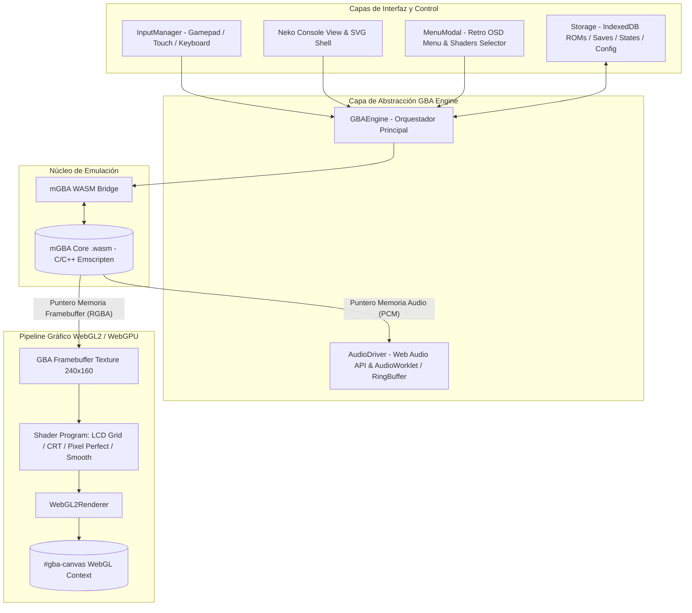

# 🐱 NekoAdvance — Plan de Arquitectura y Migración Técnica
## Fase 1: Núcleo mGBA en WebAssembly (WASM)
## Fase 2: Pipeline de Renderizado WebGL2 / WebGPU (Texture Blit & Shaders Retro)

---

## 🎯 1. Visión General y Objetivos

El objetivo de esta gran actualización es transformar **NekoAdvance** en un emulador web de Game Boy Advance de **grado profesional, máxima fidelidad y rendimiento insuperable**, mediante dos pilares fundamentales:

1. **Reemplazo del Core actual (`gbajs`) por mGBA compilado a WebAssembly (WASM)**:
   - mGBA es considerado el emulador de GBA más preciso, optimizado y compatible del mundo (100% de compatibilidad comercial, emulación precisa de timings de CPU ARM7TDMI, PPU, APU, RTC, Flash 128KB, sensores solares y giroscopio).
   - Rendimiento nativo de 60 FPS estables incluso en móviles económicos, con capacidad de Fast-Forward fluido de 2x a 32x.

2. **Reemplazo del Renderizador Canvas 2D por WebGL2 (con base para WebGPU)**:
   - Carga directa del framebuffer de GBA ($240 \times 160$) a una textura de GPU (`Texture Blit` vía `gl.texSubImage2D`).
   - Implementación de un **Pipeline de Shaders GLSL** de post-procesado en tiempo real:
     - **Filtro LCD GBA Auténtico**: Rejilla de subpíxeles LCD característica de la pantalla original de Game Boy Advance (AGB-001 / AGS-101) con líneas de separación y corrección de gamma/color.
     - **CRT Scanlines**: Líneas de escaneo y brillo retro para pantallas clásicas.
     - **Pixel Perfect (Nearest Neighbor)**: Nitidez absoluta con escalado proporcional/entero.
     - **Bilinear Smooth**: Suavizado clásico libre de artefactos.
     - **HQ2x / Scale2x**: Suavizado geométrico de bordes.

---

## 🏗️ 2. Nueva Arquitectura del Sistema



---

## 🔍 3. Análisis de Consecuencias y Desafíos Técnicos

### 3.1. Gestión de Memoria y Transferencia de Framebuffer (WASM ➡️ GPU)
- **Situación actual**: `gbajs` devuelve un `ImageData` de JavaScript y lo pinta mediante `ctx.putImageData(imgData, 0, 0)`.
- **Nuevo enfoque**:
  - mGBA en C mantiene un búfer de píxeles interno en su memoria lineal de WebAssembly (`HEAPU32` / `HEAPU8`).
  - La resolución nativa de GBA es de $240 \times 160$ píxeles. En formato `RGBA8888`, esto equivale a $240 \times 160 \times 4 = 153.600\text{ bytes}$ por fotograma.
  - Se expone una función en C `mgba_get_framebuffer()` que devuelve el puntero en la memoria de WebAssembly.
  - El renderizador WebGL crea una vista directa `Uint8Array(wasmMemory.buffer, ptr, 153600)` y la envía a la textura con `gl.texSubImage2D` **sin copias intermedias de memoria**.

### 3.2. Sustitución de Filtros CSS por Shaders GLSL de Fragmentos
- **Situación actual**: El menú tenía un toggle de "scanlines" que aplicaba una capa CSS semitransparente con `linear-gradient`, lo cual generaba artefactos de escalado y consumía recursos de composición en el navegador.
- **Nuevo enfoque**:
  - Todo el filtrado gráfico se traslada a la GPU mediante **Fragment Shaders en GLSL (OpenGL ES 3.0 / WebGL 2.0)**.
  - Se creará una arquitectura de shaders intercambiables en caliente (`setShader(shaderName)`):
    1. `lcd-grid.frag`: Emula los subpíxeles RGB de la pantalla LCD de la GBA, con atenuación entre celdas y corrección de espacio de color (GBA Color Gamut Correction para evitar colores sobre-saturados).
    2. `crt-scanlines.frag`: Scanlines horizontales dinámicas sincronizadas con la resolución de pantalla y curvatura opcional.
    3. `pixel-perfect.frag`: Renderizado con interpolación Nearest Neighbor con `gl.NEAREST` para una estética 100% nítida.
    4. `smooth.frag`: Interpolación bilinear limpia.
  - El selector en el menú OSD permitirá cambiar el shader en tiempo real con vista previa instantánea.

### 3.3. Subsistema de Audio de Alta Fidelidad
- **Situación actual**: `gbajs` usaba un driver básico de Web Audio.
- **Nuevo enfoque**:
  - mGBA sintetiza audio estéreo de alta calidad (canales PSG 1-4 + DirectSound A/B) a 44.100 Hz o 48.000 Hz.
  - Se implementará un **Ring Buffer (Búfer Circular)** con `AudioWorkletNode` (con fallback a `ScriptProcessorNode`) y **Dynamic Audio Resampling**:
    - Si el emulador va ligeramente más rápido o lento por fluctuaciones del refresco de pantalla, el driver ajusta dinámicamente la velocidad de muestreo para evitar chasquidos (crackling) y cortes de sonido.
    - Soporte de silenciamiento inmediato al usar Fast-Forward (aceleración).

### 3.4. Guardado de Partidas (.sav) y Save States
- **Formato `.sav`**: mGBA gestiona de forma nativa la detección automática del tipo de guardado (SRAM 32KB, EEPROM 512B/8KB, Flash 64KB/128KB con comandos Macronix/Panasonic/Atmel).
  - Al detectar escrituras, se sincroniza el buffer a IndexedDB mediante `storage.js`.
  - Los archivos `.sav` generados son **100% idénticos a los de cartuchos reales y emuladores de PC** (RetroArch, mGBA desktop, EZ-Flash).
- **Save States**:
  - mGBA serializa todo el estado del hardware en un blob binario compacto.
  - Al guardar estado, se captura simultáneamente el fotograma actual desde WebGL (`readPixels` o snapshot de textura) para la miniatura de la UI.

### 3.5. Compatibilidad PWA y Funcionamiento 100% Offline
- El binario `mgba.wasm` y el archivo de carga `mgba.js` se integrarán en la lista de precaché del Service Worker (`sw.js`).
- Cero dependencias externas en tiempo de ejecución: la PWA seguirá funcionando sin internet.

---

## 🛠️ 4. Estructura de Archivos Propuesta

```text
NekoAdvance/
├── index.html                   # Actualizado para cargar WebGL2 y mGBA WASM
├── sw.js                        # Service Worker con caché de binarios .wasm y shaders
├── css/
│   ├── main.css
│   ├── console.css
│   ├── modal.css                # Estilos para nuevo selector de shaders y filtros
│   └── hud.css
├── js/
│   ├── app.js                   # Bootstrap principal
│   ├── core/
│   │   ├── gba-engine.js        # Fachada principal que orquesta emulación, audio y render
│   │   ├── storage.js           # IndexedDB para ROMs, .sav, estados y configuraciones
│   │   ├── cheat-engine.js      # Interfaz de trucos conectada al core C de mGBA
│   │   │
│   │   ├── mgba/                # [NUEVO] Núcleo mGBA en WebAssembly
│   │   │   ├── mgba.wasm        # Binario compilado de mGBA
│   │   │   ├── mgba.js          # Pegamento Emscripten / Loader
│   │   │   └── mgba-bridge.js   # Wrapper JS con API limpia (init, load, runFrame, saves)
│   │   │
│   │   ├── renderer/            # [NUEVO] Pipeline de Renderizado WebGL2 / WebGPU
│   │   │   ├── webgl-renderer.js# Gestor de contexto WebGL2, texturas y blit
│   │   │   └── shaders/         # Colección de Shaders GLSL
│   │   │       ├── common.vert  # Vertex shader universal de pantalla completa
│   │   │       ├── pixel-perfect.frag
│   │   │       ├── gba-lcd.frag # Rejilla LCD original + corrección de color GBA
│   │   │       ├── crt-scanlines.frag
│   │   │       └── smooth.frag
│   │   │
│   │   └── audio/               # [NUEVO] Audio Driver con RingBuffer
│   │       ├── audio-driver.js  # Gestor de AudioContext y volumen
│   │       └── ring-buffer.js   # Búfer circular anti-crackling y resampling
│   │
│   ├── input/
│   │   ├── input-manager.js     # Mapeo a la máscara de botones de mGBA
│   │   └── keybindings.js
│   │
│   └── ui/
│       ├── console-view.js      # Interfaz de consola felina
│       ├── menu-modal.js        # Menú OSD retro con selector de Shaders/Vídeo
│       └── hud.js               # Notificaciones toast y estado
```

---

## 📋 5. Plan de Ejecución Paso a Paso

### **Paso 1: Integración del Núcleo mGBA WASM (`js/core/mgba/`)**
1. Integrar el binario compilado de **mGBA en WebAssembly** optimizado para web.
2. Crear `mgba-bridge.js`:
   - Inicialización del módulo WASM y reserva de memoria.
   - Carga de ROMs desde `ArrayBuffer` / `Uint8Array`.
   - Bucle de ejecución: `runFrame()` ejecutando exactamente un frame de GBA (280.896 ciclos CPU).
   - Mapeo de botones hacia la máscara de bits nativa de mGBA (`KEY_A`, `KEY_B`, `KEY_SELECT`, `KEY_START`, `KEY_RIGHT`, `KEY_LEFT`, `KEY_UP`, `KEY_DOWN`, `KEY_R`, `KEY_L`).
   - Métodos de guardado y carga de partidas normales (`.sav`) y Save States binarios.

### **Paso 2: Pipeline Gráfico WebGL2 con Texture Blit y Shaders (`js/core/renderer/`)**
1. Implementar `WebGLRenderer`:
   - Inicializar el contexto `webgl2` (o `webgl` con extensiones) sobre el `#gba-canvas`.
   - Crear una textura 2D $240 \times 160$ con `gl.RGBA` y parámetros de filtrado configurables.
   - Mapear un cuadrilátero de pantalla completa (2 triángulos) con coordenadas de textura UV normalizadas.
2. Programar los Fragment Shaders GLSL:
   - **`pixel-perfect.frag`**: Muestreo directo con `gl.NEAREST` preservando el aspecto 3:2.
   - **`gba-lcd.frag`**: Cálculo de coordenadas UV a nivel de píxel GBA, dibujo de la cuadrícula de matriz LCD y matriz de transformación de color para compensar la paleta de GBA.
   - **`crt-scanlines.frag`**: Modulación sinusoidal de brillo vertical para el efecto de líneas de tubo retro.
   - **`smooth.frag`**: Interpolación bilineal suave con `gl.LINEAR`.
3. Conectar el intercambio dinámico de shaders con el menú OSD.

### **Paso 3: Driver de Audio de Baja Latencia (`js/core/audio/`)**
1. Crear `AudioDriver` con `AudioContext` de 44.100 / 48.000 Hz.
2. Implementar un buffer circular de muestras PCM interleaved.
3. Añadir control de volumen máster y mute automático durante Fast-Forward.

### **Paso 4: Adaptación de `GBAEngine` y Conexión de Subsistemas**
1. Refactorizar `gba-engine.js` para delegar la emulación a `mgba-bridge.js` y el dibujado a `webgl-renderer.js`.
2. Actualizar el gestor de partidas en `storage.js` para los nuevos formatos de save state y `.sav`.
3. Conectar el motor de trucos nativo de mGBA con la interfaz de `cheat-engine.js`.

### **Paso 5: Actualización de la UI y Menú Retro (`js/ui/menu-modal.js`)**
1. Añadir en la pestaña de **Ajustes** del menú OSD un selector visual de:
   - **Filtro / Shader**: `LCD GBA (Recomendado)`, `Pixel Perfect (Nítido)`, `CRT Scanlines`, `Suave (Bilinear)`.
   - **Corrección de Color GBA**: `Activado` / `Desactivado`.
   - **Velocidad Fast-Forward**: `2x`, `4x`, `8x`, `16x`, `Ilimitada`.
2. Actualizar el Service Worker (`sw.js`) con todos los nuevos ficheros para garantizar soporte offline total.

---

## 🚀 6. Próximos Pasos

Este documento sirve como hoja de ruta técnica completa. Cuando des la confirmación, iniciaremos la ejecución comenzando por el **Paso 1 (Núcleo mGBA WASM)** y progresando ordenadamente hasta completar el **Paso 5**.
